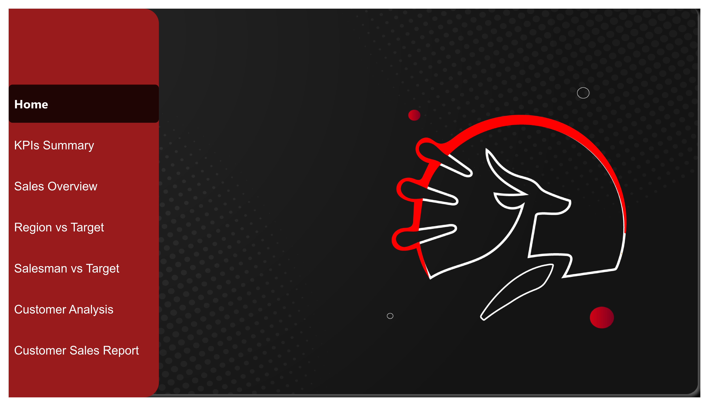
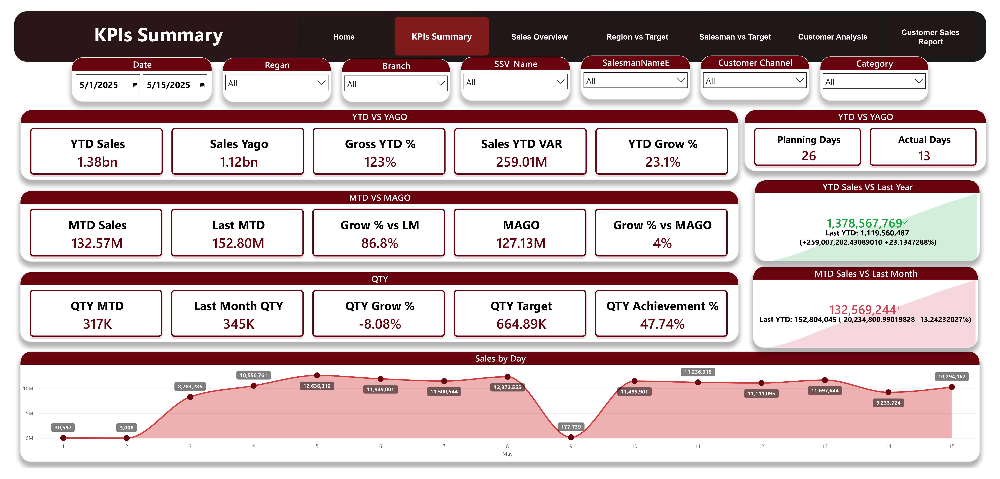
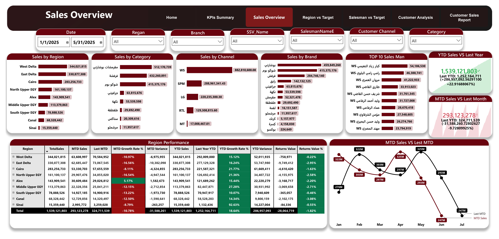
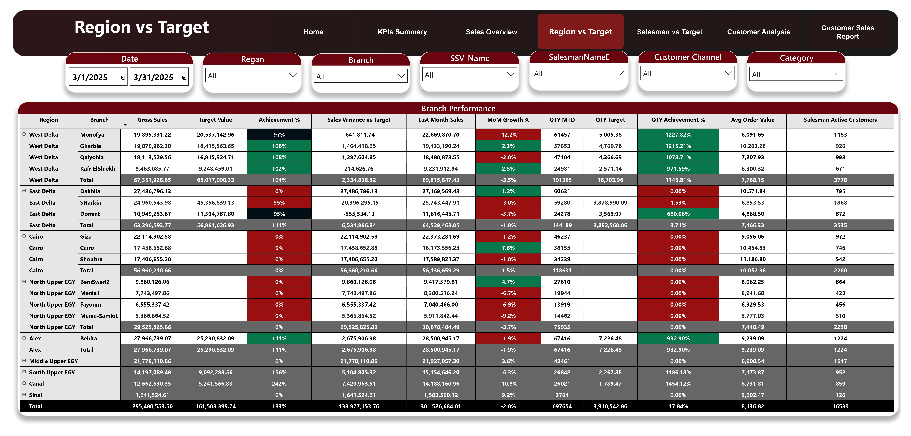
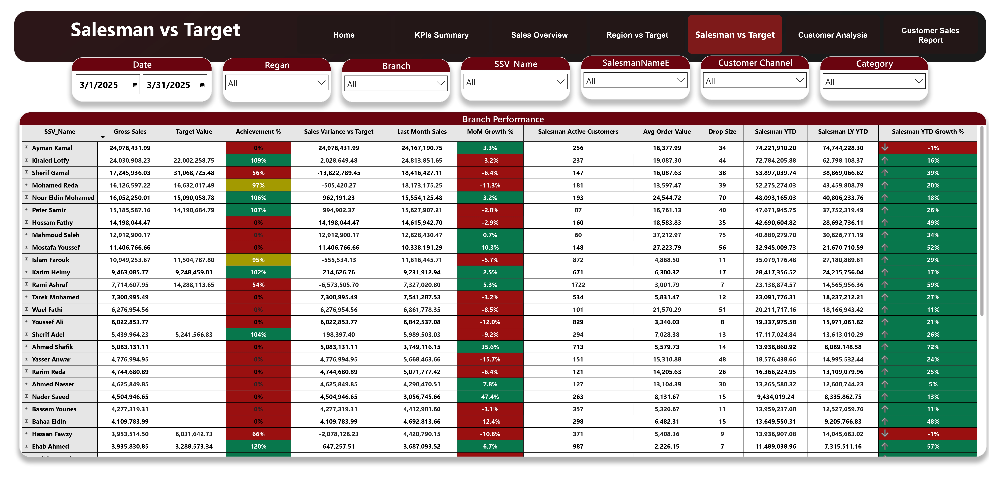
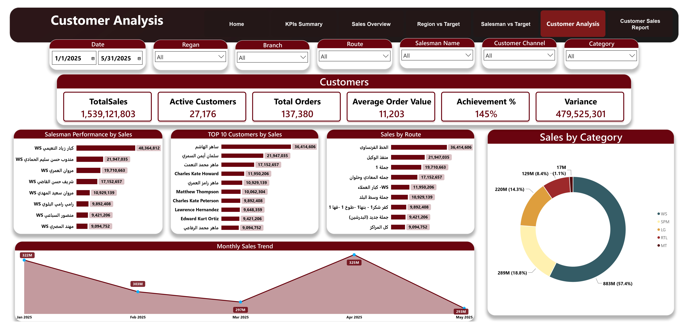
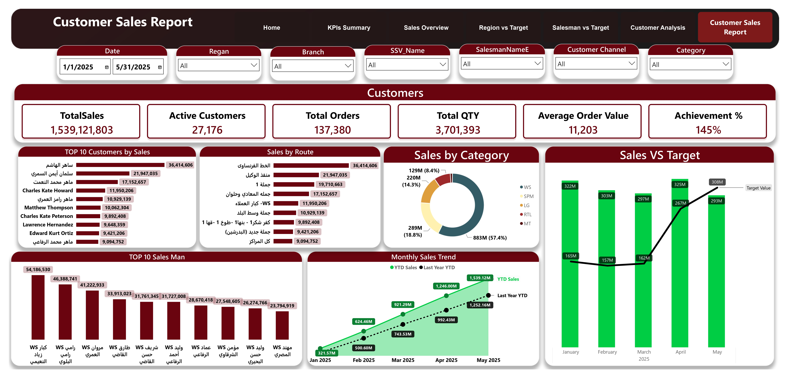

# 🛒 Enterprise Sales Performance & Dynamic Target Analytics

## 📌 Project Overview
This is an end-to-end Enterprise Business Intelligence and Data Engineering project analyzing sales performance, dynamic multi-region targets, and salesperson efficiency. The project simulates a high-scale corporate environment, handling complex transactional matrices directly connected to a relational database server.

The project demonstrates a complete corporate data analytics lifecycle:
1. **SQL & Data Engineering:** Schema extraction, entity relationship creation, primary/foreign key mapping, and granularity alignment.
2. **Power Query (ETL):** Advanced data cleaning, custom transformations, and automated data loading.
3. **Power BI & DAX:** Engineering a robust, high-performance Star Schema relational model and delivering an executive-grade 7-page interactive dashboard with dynamic UX navigation.

---

## 🛠️ Data Architecture & Engineering Pipeline

### 1. Relational Engineering & SQL Layer
Before visualization, optimized relational database principles were simulated and applied to the core tables to ensure data integrity, eliminate redundancy, and structure the data for advanced business metrics:
* **Relational Schema Mapping:** Analyzed entity structures to connect central transactional fact tables (`SalesData`, `TargetT`) with dimensional tables (`Calendar`, `ItemsT`, `SalesmanT`, `CustomerDBT`, `RouteT`) using strict **One-to-Many ($1 \rightarrow *)$** relationships[cite: 1].
* **Key Enforcement:** Configured direct relational bindings between Primary Keys (`CustomerID`, `SalesmanNo`, `ItemID`, `RouteID`)[cite: 1] and their corresponding Foreign Keys in the transaction ledger.
* **Granularity Alignment:** Resolved cross-functional filtering conflicts by bridging the gap between high-level periodic targets (`TargetT`) and dynamic, daily transactional inputs (`SalesData`)[cite: 1].
* **Performance Tuning:** Organized the analytical schema to optimize cross-filtering paths, eliminate ambiguous relationships, and ensure lightning-fast visual rendering.

### 2. Advanced Power Query ETL Layer
The relational data streams were processed through Power Query to execute rigorous data transformation steps:
* **Schema Standardization:** Cleaned, formatted, and typed mixed transactional fields, ensuring exact alignment across text, numeric, and currency attributes.
* **Custom Date Dimension:** Developed an enterprise calendar dimension supporting specialized corporate time-intelligence (Weeks, Active Days, Working Days, and fiscal periods)[cite: 1].
* **Null & Exception Handling:** Implemented robust filtering logic to eliminate structural data gaps and maintain 100% data auditing precision.

### 3. Data Modeling (Robust Star Schema)
In Power BI, the optimized **Star Schema** architectural framework ensures swift filter propagation:
* **Fact Tables:** `SalesData` (Core business transactions)[cite: 1] and `TargetT` (Dynamic budget definitions)[cite: 1].
* **Dimension Tables:** `Calendar` (Time dimension)[cite: 1], `ItemsT` (Product details)[cite: 1], `SalesmanT` (Staff metadata)[cite: 1], `CustomerDBT` (Customer master data)[cite: 1], and `RouteT` (Logistics channels)[cite: 1].

---

## 📐 Analytics & DAX Calculations
A centralized calculation layer was authored to compute critical corporate KPIs and period-over-period variance metrics using advanced **DAX**:

* **Total YTD Sales:**
  $$Total\ YTD\ Sales = TOTALYTD(SUM(SalesData[ConvertedQty] * SalesData[UnitPrice]), 'Calendar'[Date])$$
* **Target Achievement %:** Tracks how effectively a region or salesperson fulfilled corporate goals:
  $$Target\ Achievement\ \% = DIVIDE(SUM(SalesData[LineTotal]), SUM(TargetT[Target]), 0)$$
* **Sales Variance vs Target:** Measures financial deviations against corporate budgets:
  $$Sales\ Variance\ vs\ Target = [Gross\ Sales] - SUM(TargetT[Target])$$
* **Average Order Value (AOV):** Monitors transactional sizing efficiency:
  $$Average\ Order\ Value\ (AOV) = DIVIDE(SUM(SalesData[LineTotal]), DISTINCTCOUNT(SalesData[OrderID]), 0)$$

---

## 📈 Key Business Insights & Achievements
* **Financial Standing:** Successfully monitored **$1.38 Billion in YTD Sales**[cite: 1], achieving an impressive **23.1% Year-Over-Year (YoY) growth rate**[cite: 1] compared to the previous cycle.
* **Operational Scale:** Aggregated and audited multi-layer transactions tracking over **27,176 Active Customers**[cite: 1] and **137,380 Total Orders**[cite: 1] across complex regional boundaries.
* **Target Accountability:** Implemented conditional performance grids mapping high-achieving segments (e.g., 100%+ milestones)[cite: 1] against underperforming cells to optimize resource and supply chain distribution.
* **Salesforce Velocity:** Audited individual salesperson growth metrics (**MoM & YTD Growth %**)[cite: 1] alongside logistics metrics such as **Drop Size**[cite: 1] to boost overall field efficiency.

---

## 📊 Dashboard & Report Preview

### 1. Relational Data Model (Optimized Star Schema)

### 2. Interactive Navigation Hub (Home)

### 3. Executive KPIs Summary Page

### 4. Enterprise Sales Overview Page

### 5. Branch Performance Matrix (Region vs. Target)

### 6. Salesforce Tracking Matrix (Salesman vs. Target)

### 7. Customer Behavioral & Cohort Analysis

### 8. Granular Customer Sales Audit Report

---

## 📂 Download Project Files
📥 [Download Power BI (.pbix) Source File](./Sales_Performance_Dashboard.pbix)

---

## 🚀 Corporate Value
This enterprise solution serves as a unified single source of truth for sales directors. By bridging the gap between structural database schema design and visual analytics, it empowers stakeholders to minimize audit times, track field performance instantaneously, and optimize sales targets dynamically.
